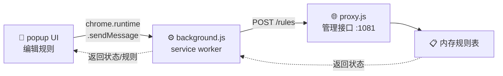
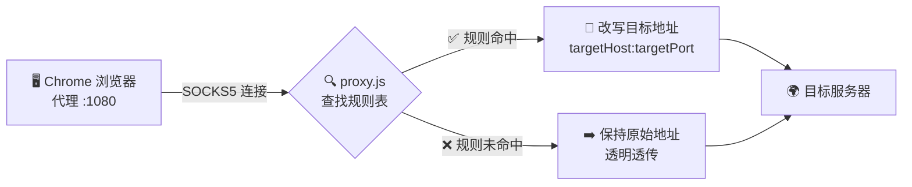

<div align="center">
  
</div>

<h1 align="center">Host Switcher</h1>

<p align="center">
  🧩 Chrome 扩展 + 🌐 本地 SOCKS5 代理<br />
  增强版 SwitchHosts —— 支持端口级规则的 TCP 连接转发工具
</p>

<p align="center">
  
  
  
  
</p>

---

Host Switcher 是一个 **Chrome 扩展 + 本地代理** 组合工具，在 Chrome 工具栏提供 SwitchHosts 风格的图形界面，通过 `host:port` 规则管理 TCP 连接的目标地址转发，**地址栏不变，HTTPS 证书正常校验**。

适用于本地开发调试时，将特定域名流量指向内网测试环境。

---

## ✨ 特性

- **Chrome 工具栏 popup** — 类 SwitchHosts 界面，按组管理规则，双击重命名，即改即用
- **支持端口规则** — 突破 hosts 只能配 IP 的限制，可精确到 `域名:端口`
- **TCP 连接级转发** — 非 HTTP 代理，不影响 URL 和 HTTPS 证书
- **自动去重** — 多组规则按 `host:port` 自动去重，先到先得
- **代理状态自动检测** — popup 实时显示代理运行状态，断开重连后自动推送规则

---

## 工作原理

系统分为 **控制面**（规则下发）和 **数据面**（流量转发）两层。

### 阶段一：规则下发



用户在 popup 中编辑规则 → 自动保存到 `chrome.storage.local` → background.js 编译并 POST 到代理的管理接口。

### 阶段二：流量转发



- Chrome 的 SOCKS5 代理指向 `127.0.0.1:1080`（由扩展自动配置）
- 代理收到连接后，在规则表中查找 `host:port`
- 命中 → 将目标地址改写为规则中指定的 `targetHost:targetPort`
- 未命中 → 保持原始目标，透明透传

---

## 快速开始

### 前置要求

- [Chrome](https://www.google.com/chrome) 浏览器
- [Node.js](https://nodejs.org) ≥ 18（推荐 `brew install node`）

### 1 安装扩展

1. 打开 `chrome://extensions`
2. 开启右上角 **开发者模式**
3. 点击 **加载已解压的扩展程序**
4. 选择本项目中的 `extension/` 目录

### 2 启动代理

```bash
cd proxy
./start-proxy.sh
```

或直接 `node proxy.js`。

### 3 配置规则

点击 Chrome 工具栏的 Host Switcher 图标打开 popup：

1. 点击 **+ 新建组**，双击组名重命名
2. 在右侧编辑器中按 hosts 风格添加规则（修改自动保存）
3. 打开组开关和顶部的总开关即可生效

---

## 规则格式

每行一条 `<目标IP[:端口]>  <匹配域名[:端口]>`：

```
198.51.100.1          internal-api.example.com
198.51.100.2:8443     internal-svc.example.com:443
10.0.0.1:443          secure.example.com:8443
```

- 支持多组，每组可单独启用/禁用，跨组规则自动去重
- `#` 和 `//` 开头为注释
- 匹配域名仅支持精确匹配，不支持通配符
- 匹配端口留空 = 匹配所有端口

---

## 代理配置

### 环境变量

| 变量 | 默认值 | 说明 |
|------|--------|------|
| `HOSTSWITCHER_SOCKS_PORT` | `1080` | SOCKS5 监听端口 |
| `HOSTSWITCHER_ADMIN_PORT` | `1081` | 管理 HTTP 接口端口 |
| `HOSTSWITCHER_ADMIN_BODY_LIMIT` | `100MB` | POST body 大小上限 |

### 管理 API

| 方法 | 路径 | 说明 |
|------|------|------|
| `GET` | `/status` | 代理运行状态 |
| `GET` | `/rules` | 当前规则列表 |
| `POST` | `/rules` | 更新规则 |

---

## 运行测试

```bash
node test/parser.test.js
```

---

## 项目结构

```
└── extension/              # 🔧 Chrome 扩展（Manifest V3）
│   ├── manifest.json       #   扩展清单
│   ├── background.js       #   Service Worker
│   ├── popup.html/.js/.css #   popup 界面
│   └── lib/parser.js       #   规则解析引擎
│
├── proxy/                  # 🌐 本地 SOCKS5 代理
│   ├── proxy.js            #   代理主程序
│   └── start-proxy.sh      #   启动脚本
│
└── test/                   # ✅ 测试
    └── parser.test.js
```

---

## 许可证

MIT
